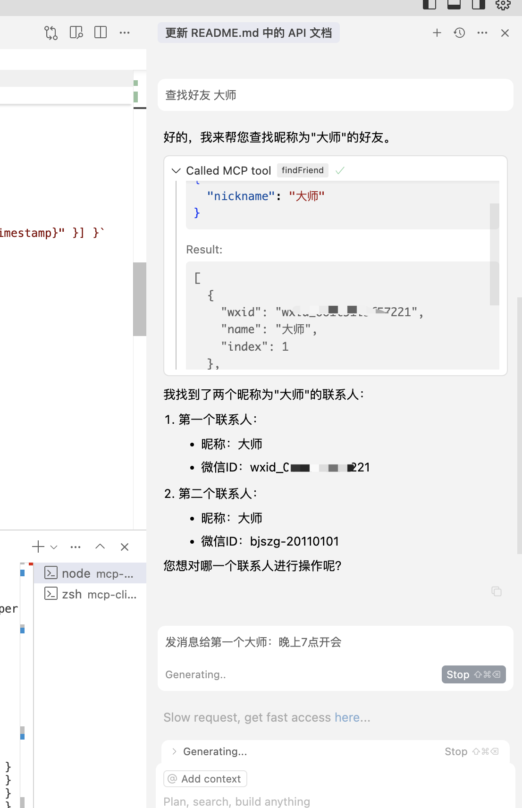
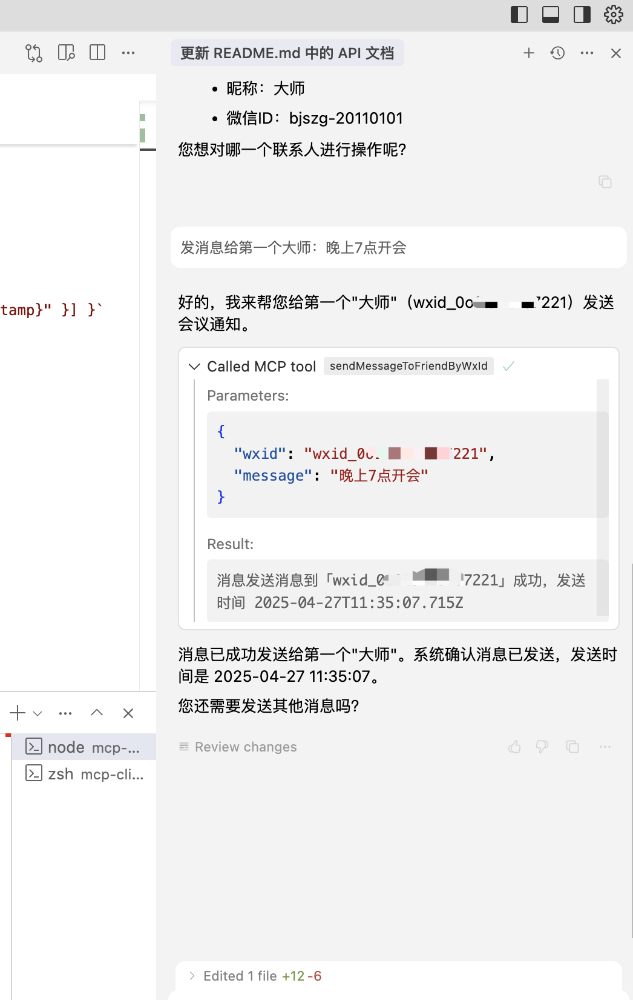

# WECHATY-MCP-SSE

基于TypeScript实现的Wechaty-MCP-SSE服务器，提供Wechaty相关功能，用于连接Claude等大型语言模型和Wechaty。

[chat-wechat](https://github.com/atorber/chat-wechat)的MCP版本，MCP使的这一实现极大简化。

## 功能

- 使用昵称查询好友信息

- 使用群名称查询群信息

- 向好友发送消息

- 向群发送消息

## MCP配置信息

```
{
  "mcpServers": {
    "wechaty-mcp-sse": {
      "url": "http://localhost:8083/sse"
    }
  }
}
```

## 使用示例





## 安装与运行

1. 安装依赖

```bash
cd mcp-sse-server
npm install
```

2. 创建环境配置文件

```bash
cp .env.example .env
```

3. 启动开发服务器

```bash
npm run dev
```

4. 构建生产版本

```bash
npm run build
```

5. 启动生产服务器

```bash
npm start
```

## MCP 工具说明

1. **sendMessageToFriend**: 向好友发送消息

   - 参数: 
     - nickname: 好友昵称（必填）
     - message: 消息内容（必填）
   - 返回: 
     - 成功：`{ content: [{ type: "text", text: "消息发送消息到「{nickname}」成功，发送时间 {timestamp}" }] }`
     - 失败：`{ content: [{ type: "text", text: "「{nickname}」用户不存在" }] }`

2. **sendMessageToRoom**: 向群组发送消息

   - 参数: 
     - topic: 群组名称（必填）
     - message: 消息内容（必填）
   - 返回: 
     - 成功：`{ content: [{ type: "text", text: "消息发送消息到「{topic}」成功，发送时间 {timestamp}" }] }`
     - 失败：`{ content: [{ type: "text", text: "「{topic}」群组不存在" }] }`

## 与 Claude 集成

该服务器专为与 Claude 等大型语言模型集成而设计，使用 MCP 协议实现工具调用。集成步骤：

1. 启动 MCP SSE 服务器
2. 使用 MCP 客户端连接到服务器获取工具列表
3. 将工具信息传递给 Claude API
4. Claude 可以根据用户需求调用相应的工具
5. 客户端处理工具结果并返回给用户


## 容器化部署

可使用 Docker 进行容器化部署，示例 Dockerfile 如下：

```dockerfile
FROM node:18-alpine

WORKDIR /app

COPY package*.json ./
RUN npm ci --only=production

COPY dist/ ./dist/

EXPOSE 8083

USER node

CMD ["node", "dist/index.js"]
```
